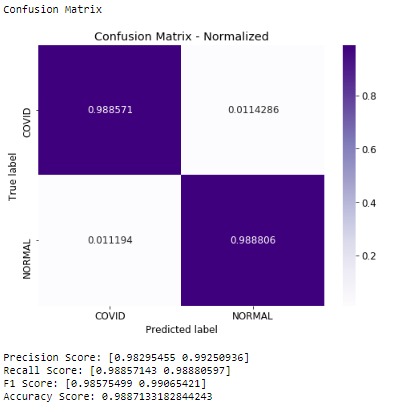
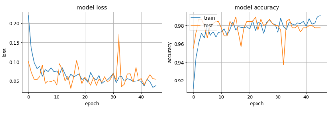
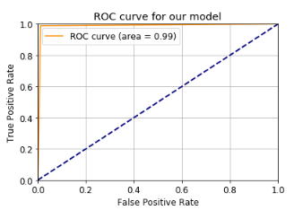
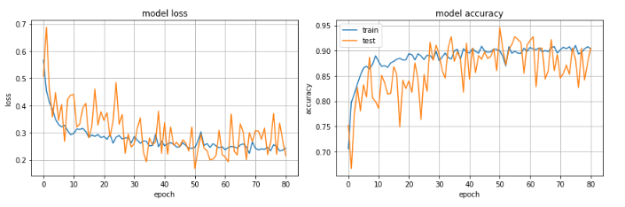
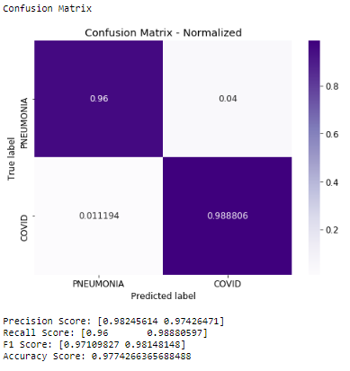
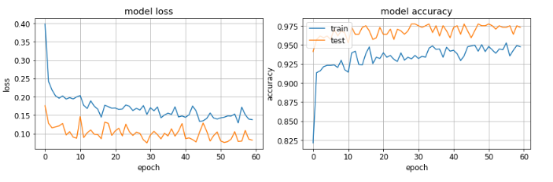

# iDiagnosis Flask Web App

### Diagnosing Lung Diseases Using AI
<a href="https://github.com/ariavathlete/aidiagnosis/blob/master/Clinical%20Case%20of%20Lung%20Disease.pdf">PRESENTATION</a>
<a href="https://github.com/ariavathlete/aidiagnosis/blob/master/Diagnosing_Pneumonia_Blog.pdf">| BLOG</a>

  
  
 # Table Of Contents
* [Purpose](#purpose)
* [Data Description](#data-description)
* [Data Augmentation](#data-augmentation)
* [Model](#model)
* [Covid-19 Models Results](#covid-19-models-results)
* [Pneumonia Models Results](#pneumonia-models-results)
* [Pneumonia vs Covid-19 Models Results](#pneumonia-vs-covid-19-models-Results)
* [Recommendation](#recommendation)
* [Web App Features](#web-app-features)
* [Web App Structure](#web-app-structure)
* [Setup](#setup)
* [Configuration](#configuration)
* [Future Work](#future-work)
  
 ## Preview
  
  
  
## Purpose
The purpose of this research is to build a classifier that can correctly distinguish between Pneumonia and Covid-19. Why lung diseases?

* 100,000 Deaths per year due to the misdiagnosis of pneumonia. Wrongful diagnosis of pneumonia can be very life threatening given that it leads to an increase in severity due to lack of treatment. Especially in cases where the patient might have a more serious infection like COVID-19.

* Pneumonia is the reason for 1 out of 6 childhood death making it the leading cause of fatality in kids under 5 years.

* In the United States, the death rate of pneumonia is 10 out of every 100,000 individuals and this usually the rate in most developed countries. Meanwhile, in Africa, the death rate of pneumonia is 100 out of every 100,000 individuals and this is normal in most developing countries.

## Data Description
For this research, I used the Pneumonia vs Covid-19 dataset from Kaggle’s website. I used 3,554 x-ray images of patient which were labeled by a specialist as either Covid-19 or Pneumonia. The merged dataset file can be found in the xray folder of this repository. The datasets downloaded can be found: 
* https://www.kaggle.com/muhammadmasdar/pneumonia-virus-vs-covid19
* https://www.kaggle.com/prashant268/chest-xray-covid19-pneumonia
* https://www.kaggle.com/paultimothymooney/chest-xray-pneumonia

  

## Data Augmentation
The data was imbalanced so I'll use ImageDataGenerator to create additional dataset to help our modeling training. This will allow the network to see more diversification withing the dataset without any reduction in how representative the dataset for each category is during training. I won’t do the same for the test dataset as I won’t want to tamper with the data that I’ll be validating with. My parameters here are;

* shear_range=0.2
* rotation_range=20
* width_shift_range=0.2
* height_shift_range=0.2
* horizontal_flip=True
* vertical_flip=False
* zoom_range=0.2

## Model
The network used is VGG19 because it’s known for having pretty high accuracies for image classification problems so I have no doubt it would work perfectly for my problem. After importing my VGG19 model and set the appropriate weights for the type of images in the dataset and set the Include Top parameter to false. This will ensure that the last layer is drop and I did this because I don’t want to classify thousand different categories when my specific problem only has two categories. So, for this I skip the last layer. The first layer is also dropped since I can simply provide my own image size as I did.

After that, I inserted the images using flow. My parameters are; 32 images should be used for training at a given instance (batch size), my image size is 64 X 64.

### Callback Parameters:
#### ModelCheckpoint
* monitor = val_loss
* mode = min
* save_best_only = True
* verbose = 1
#### EarlyStopping
* monitor = val_loss
* mode = min
* save_best_only = True
* verbose= 1
#### ReduceLROnPlateau
* monitor = val_loss
* patience = 30
* verbose = 1 
* factor = 0.8
* min_lr = 0.0001
* mode = auto
* min_delta = 0.0001
* cooldown = 5

I go on and apply the same parameters I used for my training dataset to my test dataset and then I call my fit 100 epochs.

## [Covid-19 Models Results](./COVID19 vs Normal.ipynb)
The accuracy is 98 % and this is the amount of time the predicted result is actually correct.

The recall percentage is 98% and this is the probability of the model diagnosing a correct positive diagnosis out of all the times it diagnosed positive. This would be the best metric in this case as we would rather give a wrong positive diagnosis than give a wrong negative diagnosis.

  

The model loss is 0.04 out and this is the amount the model penalizes for incorrect predictions ~ 10%

  

The AUC score is 0.98 and this is the average probability that the model can diagnose each X-ray image correctly.

  
  
## [Pneumonia Models Results](./Pneumonia vs Normal.ipynb)
The accuracy is 95 % and this is the amount of time the predicted result is actually correct.

The recall percentage is 95% and this is the probability of the model diagnosing a correct positive diagnosis out of all the times it diagnosed positive. This would be the best metric in this case as we would rather give a wrong positive diagnosis than give a wrong negative diagnosis.

  

The model loss is 0.14 out and this is the amount the model penalizes for incorrect predictions ~ 10%

  

The AUC score is 0.95 and this is the average probability that the model can diagnose each X-ray image correctly.

  

## [Pneumonia vs Covid-19 Models Results](./Pneumonia vs COVID19.ipynb)
The accuracy is 95 % and this is the amount of time the predicted result is actually correct.

The recall percentage is 95% and this is the probability of the model diagnosing a correct positive diagnosis out of all the times it diagnosed positive. This would be the best metric in this case as we would rather give a wrong positive diagnosis than give a wrong negative diagnosis.

  

The model loss is 0.14 out and this is the amount the model penalizes for incorrect predictions ~ 10%

  

The AUC score is 0.95 and this is the average probability that the model can diagnose each X-ray image correctly.

  

### Recommendation
The recall score will be the main metric for this project since it’s the most important metric in medical problems given that - doctors will rather make a wrong positive diagnosis than make a wrong negative.

Health professionals are welcomed to integrate this model, after thorough verification, into their medical software to help them correctly diagnose Covid-19.

## Web App Features
- [x] User account sign up, sign in, password reset, all through asynchronous email confirmation.
- [x] Form generation.
- [x] Error handling.
- [x] HTML macros and layout file.
- [x] "Functional" file structure.
- [x] Python 3.7 compliant.
- [x] Asynchronous AJAX calls.
- [x] Administration panel.
- [x] Logging.
- [ ] Stripe subscriptions. (WIP)
- [ ] RESTful API for payments.
- [ ] Simple RESTful API to communicate with your app.

### Website Backend
- [Flask](http://flask.pocoo.org/).
- [Flask-Login](https://flask-login.readthedocs.org/en/latest/) for the user accounts.
- [Flask-SQLAlchemy](https://pythonhosted.org/Flask-SQLAlchemy/) interacting with the database.
- [Flask-WTF](https://flask-wtf.readthedocs.org/en/latest/) and [WTForms](https://wtforms.readthedocs.org/en/latest/) for the form handling.
- [Flask-Mail](https://pythonhosted.org/Flask-Mail/) for sending mails.
- [itsdangerous](http://pythonhosted.org/itsdangerous/) for generating random tokens for the confirmation emails.
- [Flask-Bcrypt](https://flask-bcrypt.readthedocs.org/en/latest/) for generating secret user passwords.
- [Flask-Admin](https://flask-admin.readthedocs.org/en/latest/) for building an administration interface.
- [Flask-Script](https://flask-script.readthedocs.io/en/latest/) for managing the app.
- [structlog](http://structlog.readthedocs.io/en/stable/) for logging.
- [Flask-DebugToolBar](https://flask-debugtoolbar.readthedocs.io/en/latest/) for adding a performance toolbar in development.
- [gunicorn](http://gunicorn.org/) for acting as a reverse-proxy for Nginx.
- [Flask-Stripe](http://stripe.com/) for subscription billing.

### Website Frontend
- [Semantic UI](http://semantic-ui.com/) for the global style. Very similar to [Bootstrap](http://getbootstrap.com/).
- [Stackpath.Bootstrapcdn](https://stackpath.bootstrapcdn.com/bootstrap/4.5.0/css/bootstrap.min.css) for the index & demo.
- [Google-api](https://fonts.googleapis.com/css?family=Amatic+SC:400,700%7CBarlow:300,400,500,600,700,800,900%7CPT+Sans:400,700&display=swap) for the results.
- [Leaflet JS](http://leafletjs.com/) for the map.

## Web App Structure
Everything is contained in the `app/` folder.
- The models can be found in `views/models` folder 
- There you have the classic `static/` and `templates/` folders. The `templates/` folder contains macros, error views and a common layout.
- I added a `views/` folder to separate the user and the website logic, which could be extended to the the admin views.
- The same goes for the `forms/` folder, as the project grows it will be useful to split the WTForms code into separate files.
- The `models.py` script contains the SQLAlchemy code, for the while it only contains the logic for a `users` table.
- The `toolbox/` folder is a personal choice, in it I keep all the other code the application will need.
- Management commands should be included in `manage.py`. Enter `python manage.py -?` to get a list of existing commands.
- I added a Makefile for setup tasks.

## Setup
- Install the requirements and setup the development environment.

	`make install && make dev`

- Create the database.

	`python manage.py initdb`

- Run the application.

	`python manage.py runserver`

- Navigate to `localhost:5000`.

## Configuration
The goal is to keep most of the application's configuration in a single file called `config.py`. I added a `config_dev.py` and a `config_prod.py` who inherit from `config_common.py`. The trick is to symlink either of these to `config.py`. This is done in by running `make dev` or `make prod`.

I have included a working mail account which takes my email and password I've securedly stored in my environment so you would need to set up an environment password for your mailing account to be able to send emails [here](https://exploreflask.com/configuration.html).

Read [this](http://flask.pocoo.org/docs/0.10/config/) for information on the possible configuration options.

## Future Work
   * Other Lung Diseases: Create a classifier to differentiate pneumonia x-rays from other lung infections like Tuberculosis, etc.
 
   * Target Detection: Create a classifier to detect what section of the lungs the infection is located.

   * Model Improvement: Collect more data and tune more layers to the transfer learning model to improve its performance.

## License

The MIT License (MIT). Please see the [license file](LICENSE) for more information.
