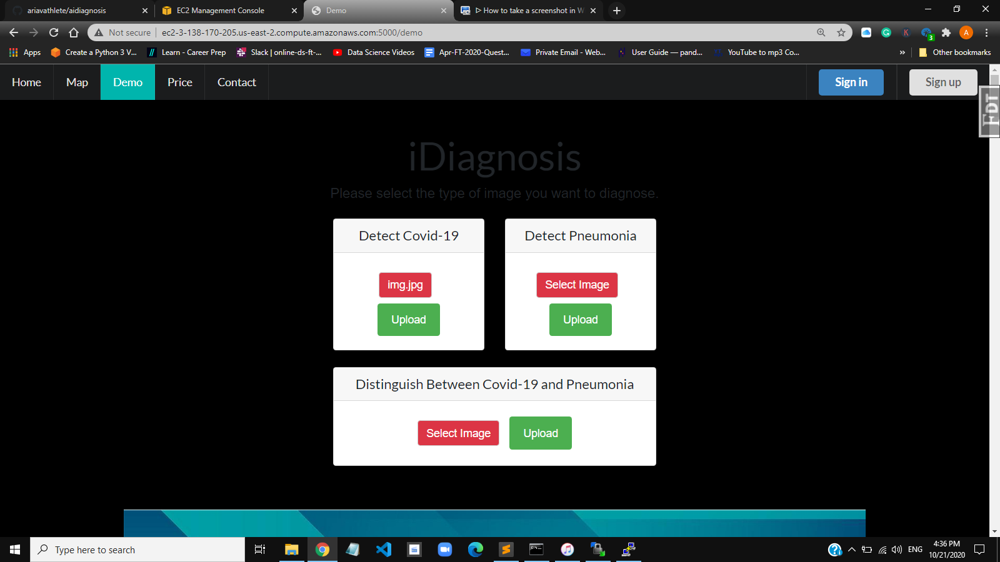
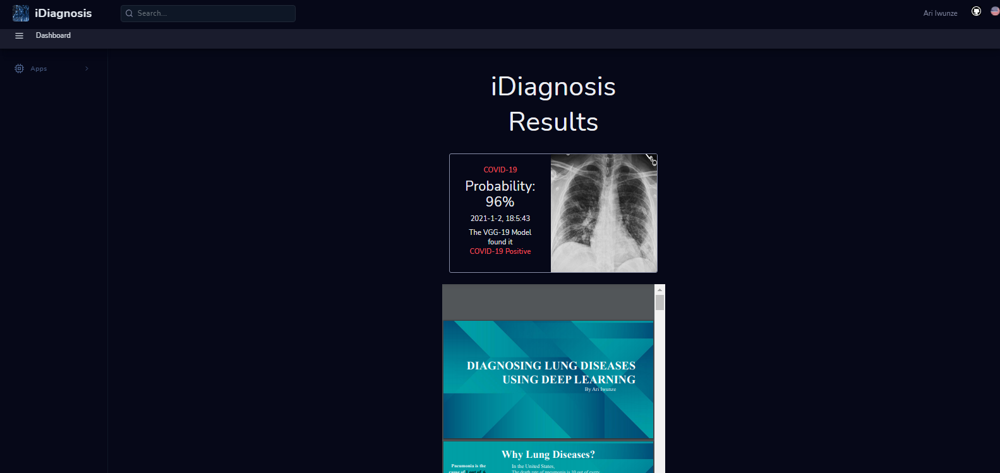

# iDiagnosis Flask Web App
  
  
## Amazon EC2 Link 
http://ec2-3-138-170-205.us-east-2.compute.amazonaws.com:5000/demo
## Features

- [x] User account sign up, sign in, password reset, all through asynchronous email confirmation.
- [x] Form generation.
- [x] Error handling.
- [x] HTML macros and layout file.
- [x] "Functional" file structure.
- [x] Python 3.7 compliant.
- [x] Asynchronous AJAX calls.
- [x] Administration panel.
- [x] Logging.
- [ ] Stripe subscriptions. (WIP)
- [ ] RESTful API for payments.
- [ ] Simple RESTful API to communicate with your app.

## Libraries

### Backend

- [Flask](http://flask.pocoo.org/).
- [Flask-Login](https://flask-login.readthedocs.org/en/latest/) for the user accounts.
- [Flask-SQLAlchemy](https://pythonhosted.org/Flask-SQLAlchemy/) interacting with the database.
- [Flask-WTF](https://flask-wtf.readthedocs.org/en/latest/) and [WTForms](https://wtforms.readthedocs.org/en/latest/) for the form handling.
- [Flask-Mail](https://pythonhosted.org/Flask-Mail/) for sending mails.
- [itsdangerous](http://pythonhosted.org/itsdangerous/) for generating random tokens for the confirmation emails.
- [Flask-Bcrypt](https://flask-bcrypt.readthedocs.org/en/latest/) for generating secret user passwords.
- [Flask-Admin](https://flask-admin.readthedocs.org/en/latest/) for building an administration interface.
- [Flask-Script](https://flask-script.readthedocs.io/en/latest/) for managing the app.
- [structlog](http://structlog.readthedocs.io/en/stable/) for logging.
- [Flask-DebugToolBar](https://flask-debugtoolbar.readthedocs.io/en/latest/) for adding a performance toolbar in development.
- [gunicorn](http://gunicorn.org/) for acting as a reverse-proxy for Nginx.
- [Flask-Stripe](http://stripe.com/) for subscription billing.

### Frontend

- [Semantic UI](http://semantic-ui.com/) for the global style. Very similar to [Bootstrap](http://getbootstrap.com/).
- [Stackpath.Bootstrapcdn](https://stackpath.bootstrapcdn.com/bootstrap/4.5.0/css/bootstrap.min.css) for the index & demo.
- [Google-api](https://fonts.googleapis.com/css?family=Amatic+SC:400,700%7CBarlow:300,400,500,600,700,800,900%7CPT+Sans:400,700&display=swap) for the results.
- [Leaflet JS](http://leafletjs.com/) for the map.

## Structure

Everything is contained in the `app/` folder.

- There you have the classic `static/` and `templates/` folders. The `templates/` folder contains macros, error views and a common layout.
- I added a `views/` folder to separate the user and the website logic, which could be extended to the the admin views.
- The same goes for the `forms/` folder, as the project grows it will be useful to split the WTForms code into separate files.
- The `models.py` script contains the SQLAlchemy code, for the while it only contains the logic for a `users` table.
- The `toolbox/` folder is a personal choice, in it I keep all the other code the application will need.
- Management commands should be included in `manage.py`. Enter `python manage.py -?` to get a list of existing commands.
- I added a Makefile for setup tasks.

## Setup

- Install the requirements and setup the development environment.

	`make install && make dev`

- Create the database.

	`python manage.py initdb`

- Run the application.

	`python manage.py runserver`

- Navigate to `localhost:5000`.

## Configuration

The goal is to keep most of the application's configuration in a single file called `config.py`. I added a `config_dev.py` and a `config_prod.py` who inherit from `config_common.py`. The trick is to symlink either of these to `config.py`. This is done in by running `make dev` or `make prod`.

I have included a working mail account which takes my email and password I've securedly stored in my environment so you would need to set up an environment password for your mailing account to be able to send emails [here](https://exploreflask.com/configuration.html).

Read [this](http://flask.pocoo.org/docs/0.10/config/) for information on the possible configuration options.

## Modelling
The network used is VGG16 because it’s known for having pretty high accuracies for image classification problems so I have no doubt it would work perfectly for my problem. 
After importing my VGG16 model and set the appropriate weights for the type of images in the dataset and set the Include Top parameter to false.
This will ensure that the last layer is drop and I did this because I don’t want to classify thousand different categories when my specific problem only has two categories. So, for this I skip the last layer. The first layer is also dropped since I can simply provide my own image size as I did.

## Interpretion
The accuracy is 91 % and this is the amount of time the predicted result is actually correct.

The recall percentage is 90% and this is the probability of the model diagnosing a correct positive diagnosis out of all the times it diagnosed positive. This would be the best metric in this case as we would rather give a wrong positive diagnosis than give a wrong negative diagnosis.
 
  

The model loss is 0.2 out and this is the amount the model penalizes for incorrect predictions ~ 10%

  

The AUC score is 0.89 and this is the average probability that the model can diagnose each X-ray image correctly.

  

## Recommendation
The recall score will be the main metric for this project since it’s the most important metric in medical problems given that - doctors will rather make a wrong positive diagnosis than make a wrong negative. 

Health professionals are welcomed to integrate this model, after thorough verification, into their medical software to help them correctly diagnose pneumonia.

## License

The MIT License (MIT). Please see the [license file](LICENSE) for more information.
